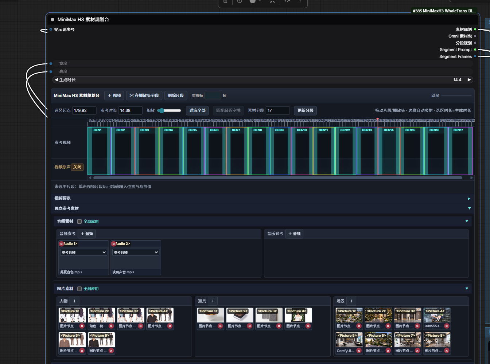
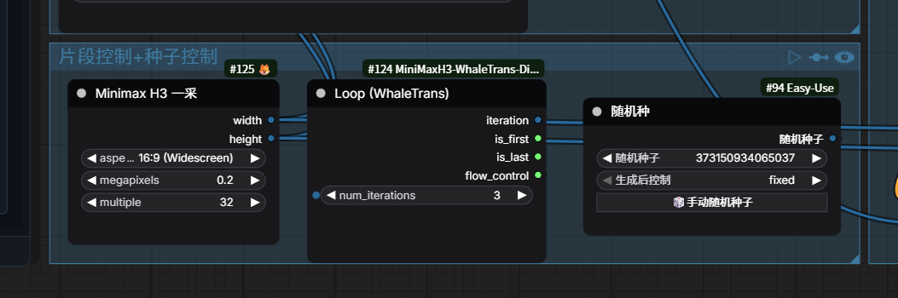
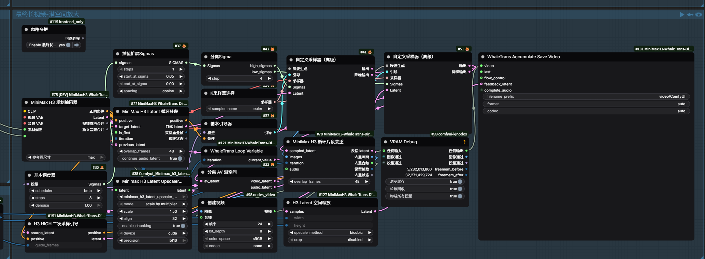

# ComfyUI MiniMax H3 WhaleTrans Director

基于 [Songssx/ComfyUI-MiniMaxH3-TimelineDirector](https://github.com/Songssx/ComfyUI-MiniMaxH3-TimelineDirector) 开发的 UI 增强版开源插件。保留了原作者时间线导演台的全部功能，在此基础上独立实现新增 **6 个自定义节点**（3 节点循环系统 + 3 个工具节点）和大量 UI 优化。循环系统使用 ComfyUI 官方 **expand 递归展开机制**实现，开箱即用。

## 🎯 设计理念

本插件由视频创作者开发，从实际创作流程出发，核心追求：**可玩性和灵活性**。

在 MiniMax H3 的创作过程中，我喜欢尝试各种新节点、新采样方法、新放大模型，把不同的技术方案组合进自己的工作流里。这个插件把时间线规划和多段循环这两个核心能力内置，而其他所有功能都通过工作流节点自由组合，方便随时尝试和调整。

### UI 优化点（来自实际创作中的痛点）

所有 UI 优化都是在大批量视频制作过程中遇到问题后逐步加上的：

- **单段启用/禁用（小眼睛）**：多段里只有个别段需要调整时，关闭其他段只跑这一段，不用全量重跑
- **小图测试→大图出图**：先跑小图验证内容和提示词，全部调通后一次性出大图，避免大图跑废浪费显存和时间
- **镜号自定义改写**：大批量段落时可提前填好镜号范围，哪段有问题直接定位修改，不用自己默数对照
- **图片/音频分类管理**：人物、道具、场景、音频参考、音乐参考分类存放，素材多了也能快速找到
- **分段时间轴自适应**：拖动片段/播放头，边缘自动吸附，选区时长=生成时长
- **帧率/时长联动**：帧率输入框可自定义，时长自动联动计算
- **素材持久化**：刷新页面素材不丢失
- **双击改编号/改名**：快速修改段落编号和名称

## 🖼️ 界面预览



## ✨ 功能特性

- **3 节点循环系统**：Loop / LoopVariable / AccumulateSaveVideo，内置循环无需融合第三方方案
- **官方 expand 机制**：使用 ComfyUI 原生递归展开，不侵入核心文件，ComfyUI 更新不受影响
- **内存优化**：全局 latent 缓存 + key 字符串引用，避免 N 次迭代复制 N 份大张量导致显存爆炸
- **运行隔离**：每次点击"运行"自动检测新运行，清理上一次中断残留状态，从第 1 段重新开始
- **H3 HIGH 二次采样引导**：解决导演台条件下 3D 潜空间放大后二次采样尺寸不匹配的问题
- **H3 Latent 分辨率**：从 H3 NestedTensor（视频+音频打包）读取像素宽高，兼容普通 latent
- **H3 Latent 空间缩放**：H3 专用 latent 空间尺寸缩放，支持 NestedTensor
- **导演台 UI 增强**：分段时间轴、帧率输入框、绿色高亮、双击改编号、素材持久化、分组三列+音频/音乐两列、全局开关、时长联动、双击改名、单段启用/禁用、镜号自定义改写等

## 📦 安装

### 方法一：Releases 下载（推荐）
1. 前往 [Releases](https://github.com/jingyu000/ComfyUI-MiniMaxH3-WhaleTrans-Director/releases) 页面下载最新版 zip
2. 解压到 ComfyUI 的 `custom_nodes` 目录
3. 重启 ComfyUI

### 方法二：git clone
```bash
cd ComfyUI/custom_nodes
git clone https://github.com/jingyu000/ComfyUI-MiniMaxH3-WhaleTrans-Director.git
```

### 依赖

- ComfyUI 0.35.1+
- MiniMax H3 模型（视频生成模型）
- **3D 潜空间放大模型**：[LBH-123-AI/Minimax_h3_latent_Upscaler](https://huggingface.co/LBH-123-AI/Minimax_h3_latent_Upscaler)（HuggingFace 下载，推荐 fp16 版本，约 691MB）
  - 下载后放到 `ComfyUI/models/latent_upscale_models/` 目录
  - 支持 1.0x – 4.0x 连续放大，基础版工作流使用 1.5x
- **3D 潜空间放大插件**：[LBH-123-AI/Comfyui_Minimax_h3_latent_Upscaler](https://github.com/LBH-123-AI/Comfyui_Minimax_h3_latent_Upscaler)（GitHub 下载，安装到 `custom_nodes` 目录）

## 🧩 节点说明

### 本插件独立新增节点（6 个）

#### 核心循环节点（3 个）



| 节点名 | 说明 |
|--------|------|
| `WhaleTransLoop` | 循环开始节点，控制循环次数，输出 iteration / is_first / is_last / flow_control |
| `WhaleTransLoopVariable` | 循环变量节点，在循环体内传递 latent 变量（上一段反馈 latent） |
| `WhaleTransAccumulateSaveVideo` | 累积保存视频，每次迭代追加帧，最后一次完成编码；同时作为 expand 循环的触发节点 |

#### 工具节点（3 个）

| 节点名 | 说明 |
|--------|------|
| `H3HighRefineGuide` | 把 3D 放大后的 latent 作为 direct latent guide 注入条件，同时透传 latent，解决导演台二次采样尺寸冲突 |
| `H3LatentResolution` | 从 H3 NestedTensor 或普通 latent 读取像素宽高（自动乘 16 倍 VAE 下采样） |
| `H3LatentShrink` | H3 专用 latent 空间尺寸缩放，支持 NestedTensor（视频+音频打包），用于回传时缩回原始尺寸 |

> **说明**：本插件完整保留了原作者的全部节点（时间线导演台、素材规划台、规划编码器、Omni素材包提示词桥、循环分段提示词、循环续段、片段去重等）。原作者的循环辅助节点最初设计为配合第三方 generic-loops 方案使用，本插件的 WhaleTrans 3 节点循环系统是独立实现，使用官方 expand 机制，不需要融合任何第三方循环方案。两套循环系统可以按需选择使用。

## 📁 示例工作流

插件 `example_workflows/` 目录包含以下示例：

| 文件 | 说明 |
|------|------|
| `MiniMax循环长视频基础版示例工作流.json` | **推荐入门**：多段循环 + 二段式采样（LOW→3D放大→HIGH引导→二次采样→去重→累积保存），可直接运行 |
| `MiniMaxH3全功能合一完全体导演台工作流.json` | 原作者全功能版工作流（参考用） |
| `MiniMax_H3时间规划+Prompt提示词生成.json` | 时间规划 + 提示词生成工作流（参考用） |

**使用方法：** ComfyUI 菜单 → `Load` → 选择对应 JSON 文件导入。

## 🎬 基础版工作流结构（多段循环 + 二段式采样）



基础版工作流结构：

```
导演台（规划编码器）→ 循环续段 → 基本引导器1 → 一次采样器（LOW）
                                                          ↓
                                              3D 潜空间放大（1.5x）
                                                          ↓
                                              H3 HIGH 二次采样引导 → 基本引导器2 → 二次采样器（HIGH）
                                                          ↓
                                              循环片段去重 → 累积保存视频
                                                          ↓
                                                    （循环回传）
```

**关键连线：**
- 一次采样器 Latent 口：原始尺寸空 AV latent
- 一次采样器引导口：循环续段后的 positive（包含上一段 latent 引导，保证段间连续性）
- 3D 放大输入：一次采样器输出
- H3 HIGH 二次采样引导 source_latent：3D 放大输出
- H3 HIGH 二次采样引导 positive：导演台直接输出的**干净 positive**（不经过循环续段）
- 二次采样器 Latent 口：H3 HIGH 二次采样引导输出的 latent（透传 3D 放大结果）
- 二次采样器引导口：H3 HIGH 二次采样引导输出的 positive → 基本引导器2
- 去重输入：二次采样器输出
- 累积保存视频输入：去重输出 + Loop is_last
- 循环回传：累积保存视频 feedback_latent → LoopVariable → 循环续段 previous_latent

## ⚙️ 技术实现

### 循环机制
使用 ComfyUI 官方 `expand` 递归展开机制，AccumulateSaveVideo 节点在每次迭代执行后，动态展开下一次迭代的所有循环体节点副本。Loop 副本的 `iteration_offset` 递增，据此计算当前迭代序号。

### 内存优化
展开图中 LoopVariable 副本的 `next_value` 不存储实际 latent 张量，而是存储全局缓存的 key 字符串（格式 `latent_{save_video_id}_{iteration}`），执行时按 key 从 `_WHALE_LATENT_CACHE` 字典读取。避免 N 次迭代复制 N 份大张量导致显存爆炸。

### 运行隔离
使用 `dynprompt` 对象 ID 区分不同次运行。每次点击"运行" ComfyUI 创建新的 DynamicPrompt 对象，SaveVideo 执行时检测到 ID 变化，自动清理上一次中断残留的视频编码器和 latent 缓存，`current_iteration` 归零，确保从第 1 段重新开始。

### HIGH 二次采样引导
导演台（规划编码器）生成的条件基于原始 latent 尺寸（如 38x22），3D 放大后 latent 尺寸变化（如 56x32），直接接入二次采样器会因条件与 latent 尺寸不匹配报错。H3HighRefineGuide 节点把放大后的 latent 作为 `direct latent guide` 注入条件的 `minimax_keyframes`，同时透传放大后的 latent 作为二次采样初值，解决尺寸冲突。

## 📖 研发背景与技术历程

### 为什么做这个插件

作为 MiniMax H3 的长期使用者，在多段长视频创作过程中遇到了几个实际问题：

1. **多段循环的使用门槛**：当时使用导演台工作流时，多段循环需要配合 rattus128 的 prs/generic-loops 方案（ComfyUI fork，需手动替换 execution.py 等核心文件），每次 ComfyUI 更新后都要重新融合一遍，比较繁琐。该方案后来被合并进 ComfyUI 官方核心（v0.36.0），成为内置的 Generic Loops（Start Loop / End Loop 节点）
2. **二段式采样的适配问题**：在导演台工作流中加入 3D 潜空间放大后，二次采样时条件和 latent 尺寸对不上，需要额外处理
3. **大批量创作的效率需求**：做几十段视频的时候，单段调试、小图验证、镜号管理这些操作需要更顺手的 UI 支持

因为这些都是自己每天要用的功能，索性就动手做了这个插件，做好了觉得用着挺顺手，就分享出来给有同样需求的创作者。

### 技术方案演进

循环实现参考了当时使用的 generic-loops 方案的设计思路，在此基础上完全重新改写：

1. **参考与借鉴**：rattus128 的 generic-loops 方案（现已合并进 ComfyUI 官方成为 Generic Loops）的设计思路为本插件提供了重要参考
2. **自行设计全局字典**：一开始为了简化工作流连接，自己设计了全局字典传递 latent 的方案，用着挺方便，但多段循环时显存占用比较高
3. **最终方案**：完全重新改写，改用 ComfyUI 官方 expand 递归展开机制，配合全局 latent 缓存 key 字符串引用，既不用改核心文件，显存占用也降下来了，而且循环内置在插件里，下载就能用，不再需要融合第三方循环方案

### 过程中解决的几个关键问题

- **显存优化**：从复制张量改为存储缓存 key，执行时按需读取
- **中断后计数错乱**：用 dynprompt 对象 ID 做运行隔离，每次新运行自动清理残留状态
- **二次采样尺寸冲突**：开发了 H3 HIGH 二次采样引导节点，注入同尺寸 direct latent guide 解决
- **二段式采样数据保留**：引导节点透传 source_latent（非空 latent），保留一次采样的数据

## ❓ 常见问题

**Q: 中断后再运行，循环从中间开始而不是第 1 段？**
A: 已修复。v1.0+ 版本使用运行隔离机制，每次新运行自动清理残留状态。如果仍有问题，重启 ComfyUI 可彻底清除。

**Q: 二次采样报 `shape mismatch` 错误？**
A: 检查二次采样的条件是否接了循环续段后的 positive（包含 previous_latent 引导）。应使用 H3 HIGH 二次采样引导节点，positive 接导演台直接输出的干净 positive。

**Q: 多段循环时显存占用高？**
A: 已优化。使用全局 latent 缓存 + key 引用，不会复制多份大张量。建议在循环体内使用 VRAM Debug 节点释放中间模型显存。

**Q: `ImageGenResolutionFromLatent` 报 `too many values to unpack (expected 4)`？**
A: 普通节点不支持 H3 的 5D NestedTensor。使用插件自带的 `H3 Latent 分辨率` 节点替代。

**Q: 基于哪个项目开发的？和原作者的关系？**
A: 基于 [Songssx/ComfyUI-MiniMaxH3-TimelineDirector](https://github.com/Songssx/ComfyUI-MiniMaxH3-TimelineDirector) 开发，完整保留了原作者的全部节点（时间线导演台、素材规划台、规划编码器、Omni素材包提示词桥、循环分段提示词、循环续段、片段去重等）和基础 UI。在此基础上新增了 6 个自定义节点（WhaleTrans 3 节点循环系统 + HIGH 二次采样引导 + Latent 分辨率 + Latent 空间缩放）和大量 UI 优化（JS 代码量从 1173 行增加到 1855 行）。

**Q: 原作者的循环节点、WhaleTrans 循环、官方 Generic Loops 有什么区别？**
A: 三套是不同的实现：
- **原作者的循环辅助节点**（循环分段提示词、循环续段、片段去重）：最初设计为配合第三方 generic-loops 方案使用，需要替换 ComfyUI 核心文件
- **官方 Generic Loops**（Start Loop / End Loop）：ComfyUI v0.36.0 内置的通用循环功能，由 rattus128 贡献，适用于通用场景
- **WhaleTrans 3 节点循环系统**：本插件独立实现，基于官方 expand 递归展开机制，专门针对 H3 长视频做了优化（latent 回传、累积保存视频、运行隔离、显存优化等），不需要替换核心文件，下载安装即可使用

三套循环系统可以按需选择，本插件的 WhaleTrans 循环和官方 Generic Loops 可以共存。

## 📄 许可证

GPL v3 - 详见 [LICENSE](LICENSE) 文件。

## 🙏 致谢

- 原作者 [Songssx](https://github.com/Songssx) 的 [ComfyUI-MiniMaxH3-TimelineDirector](https://github.com/Songssx/ComfyUI-MiniMaxH3-TimelineDirector)，本插件的时间线导演台功能和基础 UI 基于此项目
- [rattus128](https://github.com/rattus128) 的 generic-loops 方案（现已合并进 ComfyUI 官方成为 Generic Loops），为本插件的循环设计提供了重要参考和思路启发
- [LBH-123-AI](https://huggingface.co/LBH-123-AI) 的 [Minimax H3 Latent Upscaler](https://huggingface.co/LBH-123-AI/Minimax_h3_latent_Upscaler) 3D 潜空间放大模型和配套插件，基础版工作流的二段式采样依赖此模型
- ComfyUI 官方 expand 机制
- MiniMax H3 开源社区的所有探索者和贡献者
